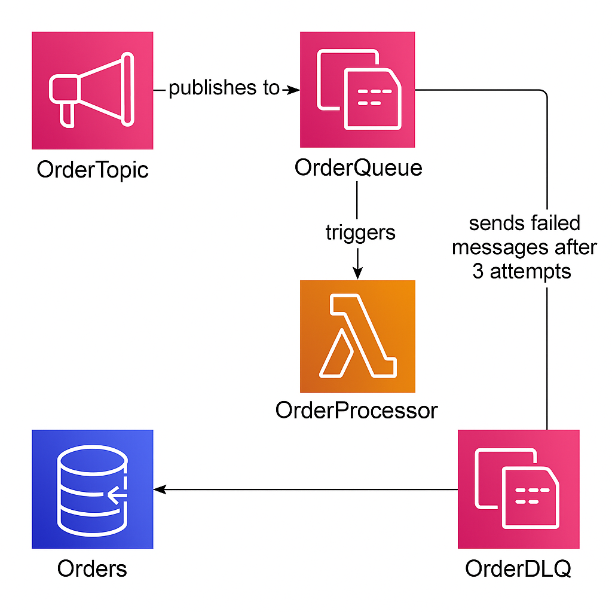
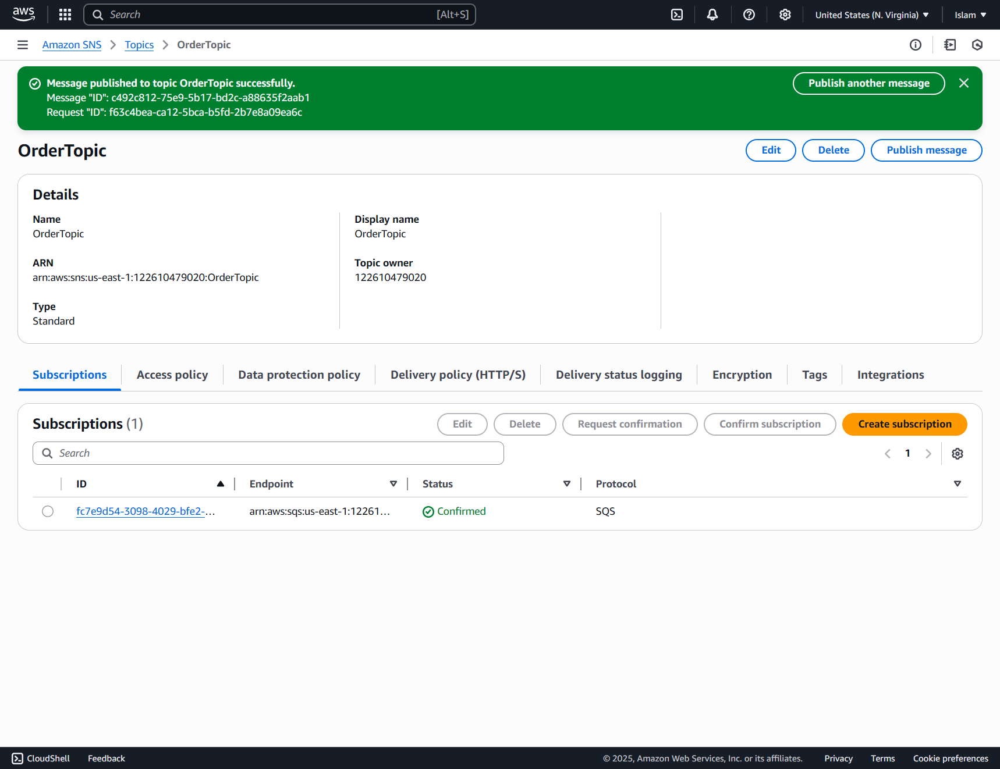
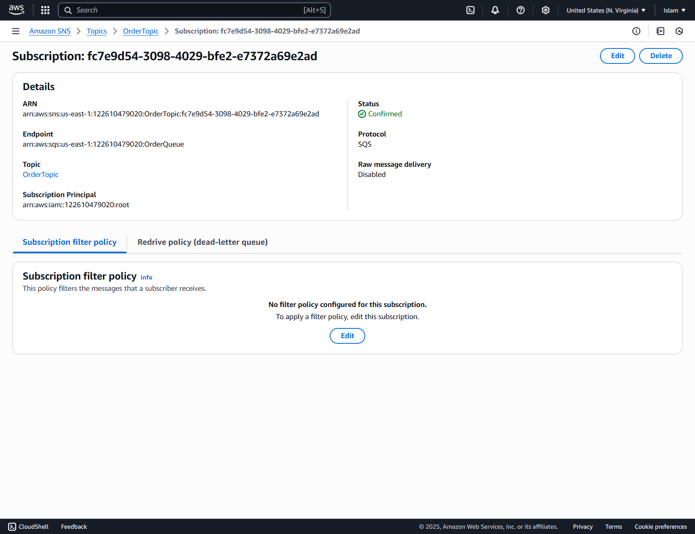
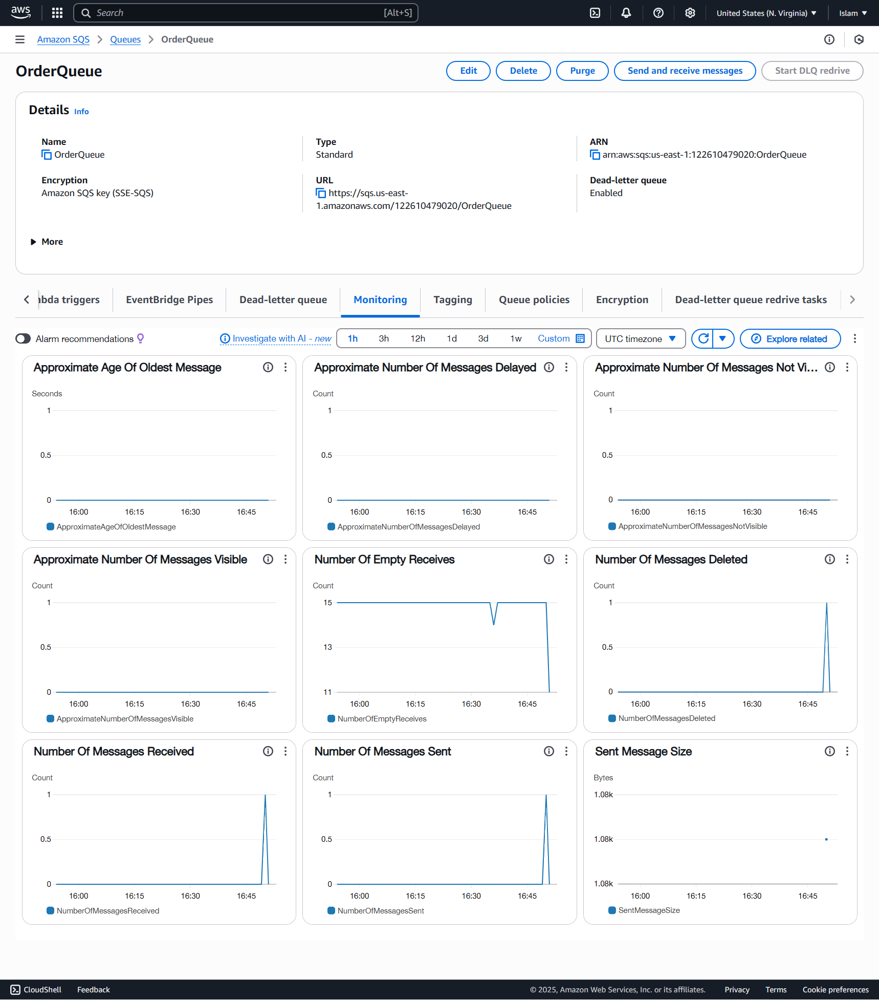
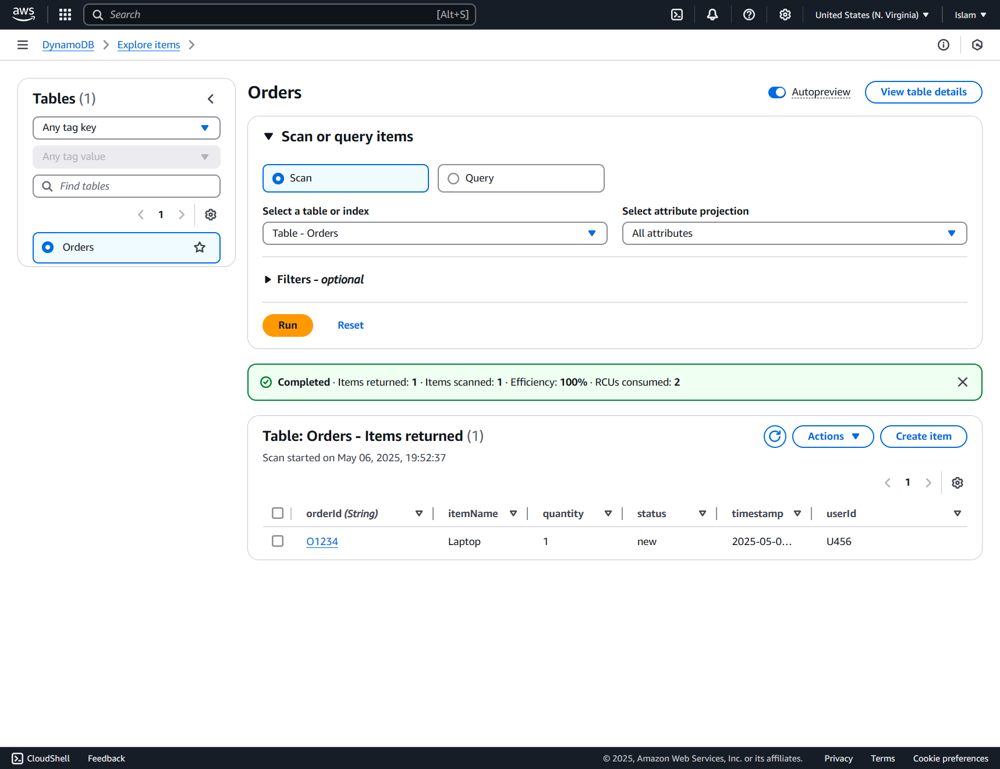
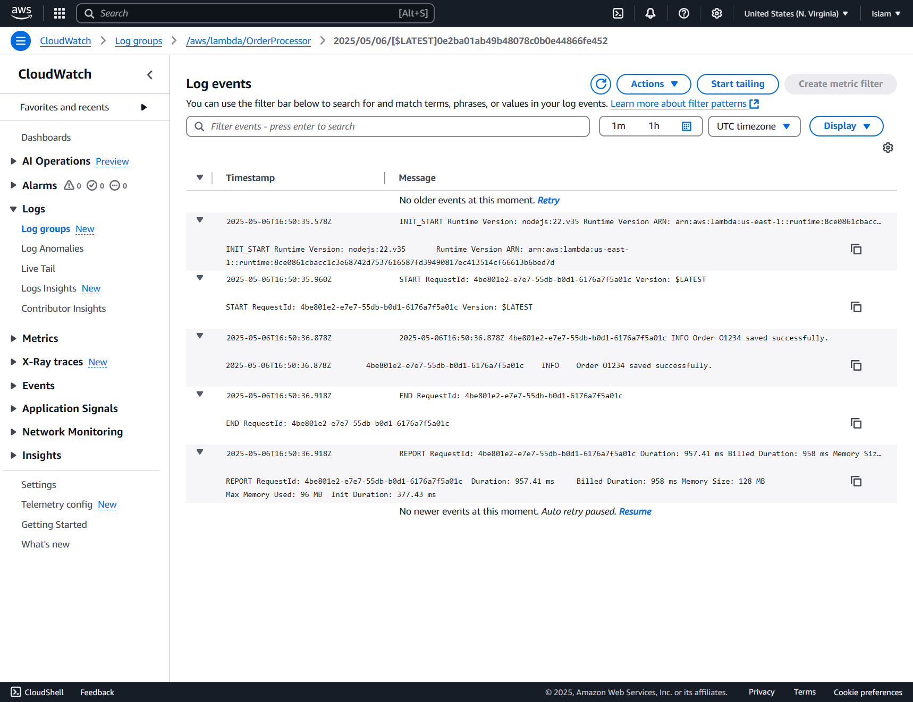

# Order Processing System - AWS Lambda, SQS, SNS, and DynamoDB

Made by Islam Hesham
ID: 10002357
Tutorial number 15

## Overview

This project implements an order processing system using AWS services. It allows orders to be submitted via SNS, routed through SQS, and finally stored in DynamoDB using a Lambda function. Failed message processing is handled using a Dead-Letter Queue (DLQ).

## Architecture

- **SNS Topic:** Publishes order messages.
- **SQS Queue (OrderQueue):** Subscribed to the SNS topic, it buffers order messages.
- **Lambda Function (OrderProcessor):** Polls messages from the SQS queue and inserts them into the DynamoDB table.
- **DynamoDB Table (Orders):** Stores order records.
- **Dead-Letter Queue (OrderDLQ):** Captures messages that fail to process after 3 attempts.

## Architecture Diagram



## Setup Instructions

### **DynamoDB**

- Create a table named `Orders` with the following attributes:
  - `orderId` (Partition Key - String)
  - Additional fields: `userId`, `itemName`, `quantity`, `status`, `timestamp`.

### **SQS**

- Create `OrderQueue` (main queue).
- Create `OrderDLQ` (dead-letter queue).
- In `OrderQueue`:
  - Enable Dead-Letter Queue and set `OrderDLQ` as target.
  - Set maxReceiveCount to 3.

### **SNS**

- Create a topic named `OrderTopic`.
- Subscribe `OrderQueue` to this topic.
- Enable **Raw Message Delivery** in the subscription.

### **Lambda Function**

- Name: `OrderProcessor`.
- Runtime: Node.js (latest stable, e.g., Node.js 18).
- Region: `us-east-1` (or your target region).
- Handler: your file name and export, e.g., `index.handler`.
- IAM Role:
  - `AWSLambdaBasicExecutionRole`
  - `AmazonDynamoDBFullAccess`
  - `AmazonSQSFullAccess` (or equivalent fine-grained inline policies).

**Environment:**

- Install `@aws-sdk/client-dynamodb` via Lambda layers or include in your deployment package.

**Lambda Code:**

```js
const { DynamoDBClient, PutItemCommand } = require("@aws-sdk/client-dynamodb");

const client = new DynamoDBClient({ region: "us-east-1" });

exports.handler = async (event) => {
  for (const record of event.Records) {
    try {
      const snsPayload = JSON.parse(record.body);
      const message = JSON.parse(snsPayload.Message);

      const params = {
        TableName: "Orders",
        Item: {
          orderId: { S: message.orderId },
          userId: { S: message.userId },
          itemName: { S: message.itemName },
          quantity: { N: message.quantity.toString() },
          status: { S: message.status },
          timestamp: { S: message.timestamp }
        }
      };

      await client.send(new PutItemCommand(params));
      console.log(`Order ${message.orderId} saved successfully.`);
    } catch (error) {
      console.error("Failed to process message", error);
    }
  }
};
```

### **Access Policies**

**SQS (OrderQueue):**

```json
{
  "Version": "2012-10-17",
  "Id": "__default_policy_ID",
  "Statement": [
    {
      "Sid": "__owner_statement",
      "Effect": "Allow",
      "Principal": {
        "AWS": "arn:aws:iam::122610479020:root"
      },
      "Action": "SQS:*",
      "Resource": "arn:aws:sqs:us-east-1:122610479020:OrderQueue"
    },
    {
      "Sid": "AllowSNSTopicToSendMessages",
      "Effect": "Allow",
      "Principal": {
        "Service": "sns.amazonaws.com"
      },
      "Action": "SQS:SendMessage",
      "Resource": "arn:aws:sqs:us-east-1:122610479020:OrderQueue",
      "Condition": {
        "ArnLike": {
          "aws:SourceArn": "arn:aws:sns:us-east-1:122610479020:OrderTopic"
        }
      }
    }
  ]
}
```

**SQS (OrderDLQ):**

```json
{
  "Version": "2012-10-17",
  "Id": "__default_policy_ID",
  "Statement": [
    {
      "Sid": "__owner_statement",
      "Effect": "Allow",
      "Principal": {
        "AWS": "arn:aws:iam::122610479020:root"
      },
      "Action": "SQS:*",
      "Resource": "arn:aws:sqs:us-east-1:122610479020:OrderDLQ"
    },
    {
      "Sid": "AllowOrderQueueToSendMessages",
      "Effect": "Allow",
      "Principal": "*",
      "Action": "SQS:SendMessage",
      "Resource": "arn:aws:sqs:us-east-1:122610479020:OrderDLQ",
      "Condition": {
        "ArnEquals": {
          "aws:SourceArn": "arn:aws:sqs:us-east-1:122610479020:OrderQueue"
        }
      }
    }
  ]
}
```

## Test Instructions

**Publish a test message to SNS:**

```json
{
  "orderId": "O1234",
  "userId": "U456",
  "itemName": "Laptop",
  "quantity": 1,
  "status": "new",
  "timestamp": "2025-05-05T15:00:00Z"
}
```

**Monitor:**

- Lambda Logs: CloudWatch → /aws/lambda/OrderProcessor
- DynamoDB: Check the Orders table.
- DLQ: Inspect OrderDLQ for failed messages (if any).

## Notes

- Ensure IAM policies are properly attached to allow Lambda to access SQS and DynamoDB.
- Always confirm the SNS subscription is active and has raw message delivery enabled.
- The system is designed to retry failed Lambda processing up to 3 times before pushing the message to DLQ.

## Screenshots

### SNS Topic + Subscription




*Description:* This screenshot shows the `OrderTopic` along with its subscription to the `OrderQueue` (ensure Raw Message Delivery is enabled).

---

### SQS Queue with Visible Message



*Description:* This screenshot displays the `OrderQueue` with at least one visible message (under "Approximate number of messages" or "Messages Available").

---

### DynamoDB Table with Inserted Item



*Description:* This screenshot shows the `Orders` DynamoDB table with a successfully inserted order item including all attributes (`orderId`, `userId`, `itemName`, `quantity`, `status`, `timestamp`).

### CloudWatch Log Showing Creation of the record



## Explanation of Visibility Timeout and Dead-Letter Queue (DLQ)

In this system, the **visibility timeout** and the **dead-letter queue (DLQ)** play a crucial role in ensuring reliable message processing and fault tolerance.

### Visibility Timeout

The **visibility timeout** on the `OrderQueue` ensures that when a message is picked up by the Lambda (`OrderProcessor`), it becomes **invisible** to other consumers for a specific period (default: 30 seconds unless modified). This prevents **duplicate processing** of the same message while the Lambda is working on it. 

If the Lambda **fails to process** the message (e.g., crashes, throws an error) and **doesn't delete the message**, the message **becomes visible again** after the timeout expires—allowing another retry.

**Why it's useful here:**
- Prevents **duplicate processing** during active execution.
- Ensures **automatic retries** if processing fails (up to the max receive count).

---

### Dead-Letter Queue (DLQ)

The **DLQ (OrderDLQ)** is linked to the main queue (`OrderQueue`) with a **maximum receive count** of 3. This means:
- If the same message fails **3 times** (gets reprocessed 3× and still fails), it is moved automatically to the DLQ.

**Why it's useful here:**
- It **captures "poison messages"**—those that are malformed or always fail due to logic errors—so they don’t keep retrying endlessly.
- It allows developers to **inspect failed messages later** and debug persistent issues **without losing data**.

---

### Combined Effect

By using **visibility timeout + DLQ together:**
- The system is **resilient**: it retries temporary failures automatically.
- It **avoids infinite retry loops** for bad data.
- It provides a **clear separation** between transient errors (solved by retries) and fatal errors (requiring human intervention).

This ensures that **no message is lost**, and every failure can be either **resolved by retry** or **tracked in the DLQ** for manual investigation.
